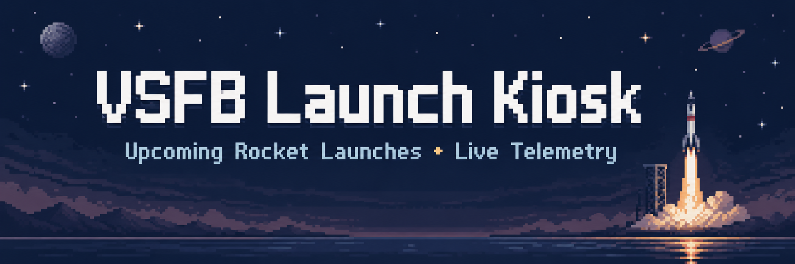
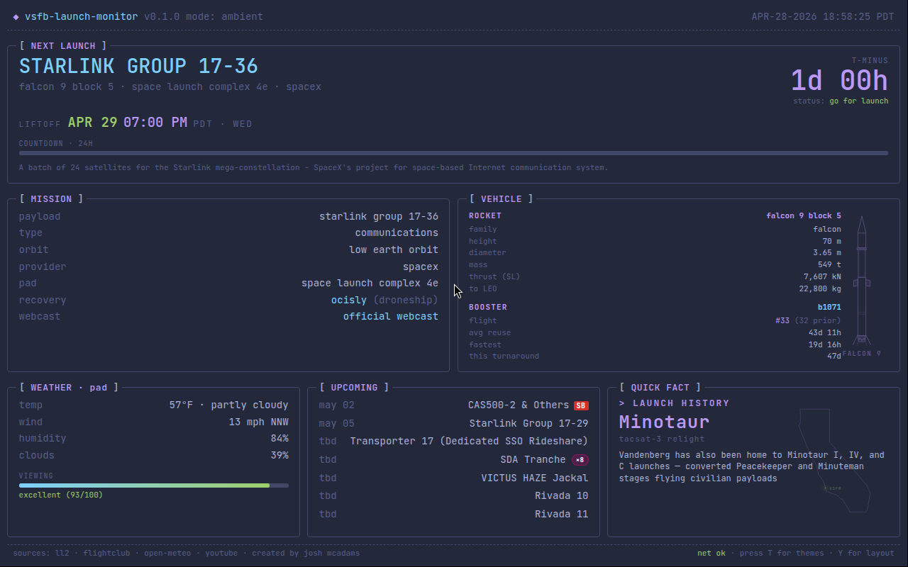
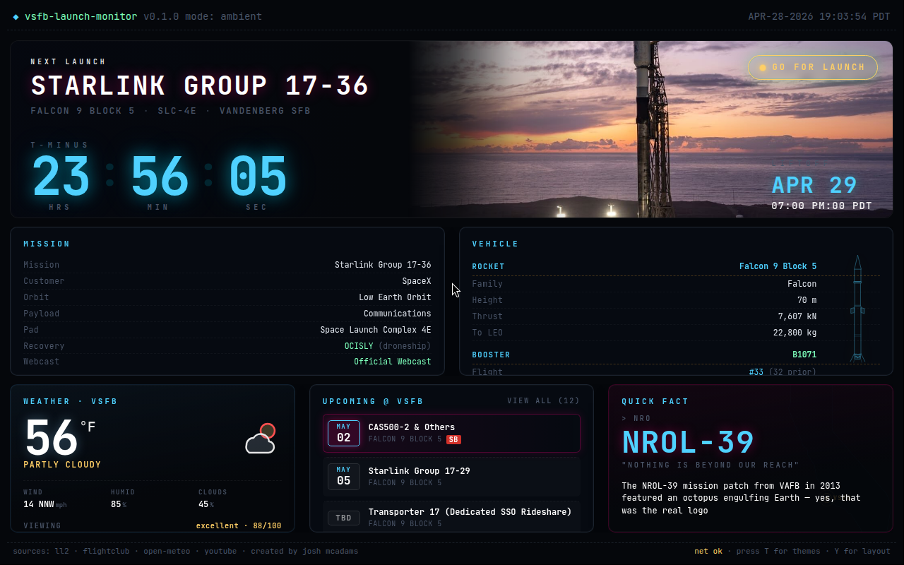
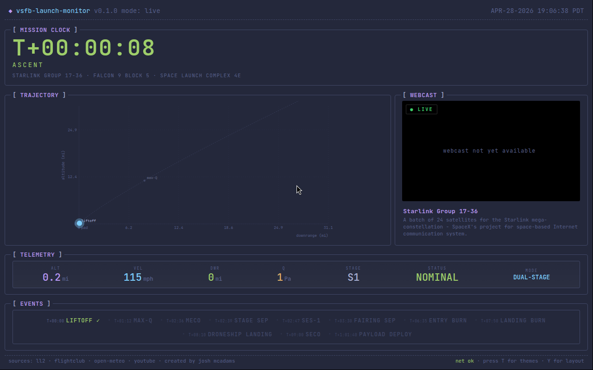
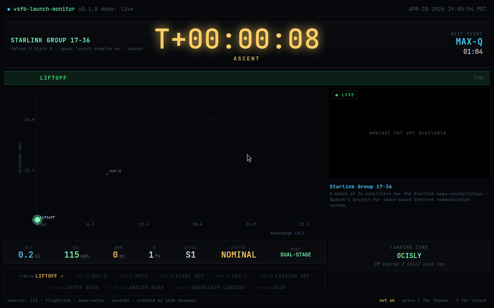

<div align="center">



# VSFB Launch Kiosk

**A wall-mountable, browser-based launch monitor for SpaceX flights from
Vandenberg Space Force Base. Two views: a calm "while-you-wait" ambient
mode and a real-time trajectory + telemetry live mode. React + Vite, no
backend, runs anywhere a browser does.**

</div>

---

## Two views, one app

This is what you stick on a TV in your office, on a 10" Pi touchscreen
in your living room, or on the iPad on your kitchen counter. It pulls
real launch + weather data, looks great, and takes care of itself —
auto-flipping into live mode when something is about to launch and back
to ambient when it's over.

## Ambient mode — the "while you wait" view



The default view, shown 24/7 except during a live ascent. Pulls the
next-launch information from Launch Library 2 and the weather from NWS,
mixes in a rotating fact card so the screen has motion, and updates
itself in the background while you go back to whatever you were doing.

**What you see:**

- **Next launch hero** — mission name, rocket, pad, GO/NO-GO status
  pill, photographic Falcon-9-on-pad backdrop (in polished layout)
- **Big T-minus countdown** with hours / minutes / seconds broken
  into broadcast-clock digits
- **Liftoff timestamp** in Pacific time + 24-hour countdown progress bar
- **Mission card** — payload, customer, orbit, mission type, pad,
  recovery (RTLS / droneship / expendable)
- **Vehicle card** — rocket model, height, diameter, mass, thrust,
  to-LEO mass, plus booster serial + flight count + reuse stats
- **Weather card** — temp, conditions, wind (with compass direction),
  humidity, cloud cover, and a 0-100 "viewing conditions" score
- **Upcoming launches** — the next 6 VSFB flights, with rideshare
  grouping (`Transporter 17 · Dedicated SSO Rideshare`)
- **Rotating fact card** — a launch-history / vehicle-trivia rotator
  that changes every ~8 seconds so the screen never looks dead
- **Sonic boom warning** — auto-shown when the booster is doing an
  RTLS landing (LZ-4 booms inland over Lompoc and Santa Maria)

### Two layouts to choose from

Same data, different vibe. Press `Y` to flip.

**Terminal** — the original aesthetic, the screenshot above. Bracketed
`[ TITLE ]` boxes, flat ANSI palettes, monospace-forward,
*btop++ but for rockets*.

**Polished** — cinematic broadcast aesthetic. Photo hero, big magenta
countdown, glowing GO/NO-GO pill, rounded cards. Designed to look
great on a TV from across the room.



Mix and match: 7 terminal palettes (tokyo-storm, gruvbox, dracula, nord,
matrix, catppuccin, solarized) and 6 polished palettes (cosmic-dusk,
aurora, ember, midnight-ops, graphite, sunrise). Press `T` to open the
theme picker, `1`–`7` to jump to a palette directly. On phones, tap the
theme button in the bottom-right to cycle.

---

## Live mode — the "it's actually happening" view



Auto-engages **20 minutes before T-0** when the launch is `GO`, and
keeps running until ~10 minutes after the second-stage SECO. The whole
screen rearranges around the trajectory.

**What you see:**

- **Real-time trajectory plot** — altitude (mi) vs. downrange (mi)
  with the rocket's path drawing in as it climbs. Event markers for
  liftoff, max-Q, MECO, stage-sep, SES-1, fairing sep, entry burn,
  landing burn, droneship landing, SECO, payload deploy
- **Mission clock** front and center — `T+00:00:08 · ASCENT`, with
  the next event ("MAX-Q in 01:04") highlighted top-right
- **Telemetry rail** — ALT, VEL, downrange, dynamic pressure (Q),
  current stage, status, single/dual-stage mode
- **Embedded webcast** — the official YouTube webcast in a corner
  iframe so you don't have to open another tab
- **Landing-zone card** — drone ship name (`OCISLY · Of Course I Still
  Love You`) or LZ designation, depending on the mission profile
- **Event timeline strip** — every flight event lined up at the
  bottom, lighting up as they happen
- **Graceful degradation** — if FlightClub.io errors, the trajectory
  falls back to a built-in nominal Falcon 9 ascent profile so the show
  goes on regardless

### Live mode also has a polished layout



Same data, broadcast aesthetic: big magenta T-mission-clock front and
center, photographic feel, soft-glow accent rails, rounded cards.
Toggle with `Y` like the ambient view.

---

## Quick start

```bash
git clone https://github.com/rofltoast/vsfb-launch-kiosk.git
cd vsfb-launch-kiosk
npm install
npm run dev
```

Open <http://localhost:5173/>. The data fetches go straight to public
APIs, so there's no `.env` to configure for the basic experience.

For production:

```bash
npm run build
# dist/ is now a static site. Drop it into nginx, Caddy, S3, whatever.
```

---

## Hardware (a.k.a. why this exists)

This started as a wall-mountable launch ticker for my office. It is
now several things, including a portable Pi 4 in a 3D-printed case
with a touchscreen and a UPS HAT, so I can take it outside and watch
the actual rocket while watching a screen show me where the actual
rocket is. Recursion.

Recommended portable build (none of this is required to run the
software — it's a web app, you can open it on a laptop):

| Part | Notes |
|---|---|
| Raspberry Pi 4 (4 GB) | Pi 5 also works; lower power draw on the 4. |
| Waveshare 10.1" HDMI IPS touchscreen | 400+ nits is the bare minimum for outdoor sun. |
| Waveshare UPS HAT (C) + 2× 18650 | Couple hours unplugged + clean shutdown. |
| 3D-printed enclosure | Whatever fits your printer. |

---

## Keyboard hotkeys (desktop)

| Key | What |
|---|---|
| `T` | toggle theme picker |
| `1`–`7` | jump to palette N (terminal: 7 palettes; polished: 6) |
| `Y` | toggle layout picker |
| `Shift+Y` | flip directly between terminal ↔ polished |
| `L` | mark a "liftoff anchor" (manual T-0 override for testing live mode) |
| `Shift+L` | clear the liftoff anchor |

On mobile the theme button bottom-right cycles themes. There is no
`T` key on a phone. We have made peace with this.

---

## How it's wired

### Source layout

```
src/
├── App.jsx                 main kiosk app (ambient + live)
├── main.jsx                tiny path-based router (no react-router)
├── components/
│   ├── AmbientView.jsx          chooses terminal vs polished
│   ├── AmbientTerminalLayout    TUI brackets + monospace
│   ├── AmbientPolishedLayout    cinematic broadcast
│   ├── LiveView.jsx             chooses terminal vs polished
│   ├── LivePolishedLayout       trajectory hero + telemetry rail
│   ├── LiveTerminalLayout       same data, TUI flavor
│   ├── TrajectoryGraph.jsx      real-time alt-vs-downrange plot
│   ├── ThemePicker / LayoutPicker / MobileThemeButton
│   └── retro/                   the optional /retro CRT broadcast app
├── lib/
│   ├── ll2.js                Launch Library 2 client
│   ├── flightclub.js         trajectory simulation client
│   ├── weather.js            NWS / Open-Meteo + viewing-score model
│   ├── quick-facts.js        rotating fact pool
│   ├── upcoming.js           rideshare grouping, NET parsing
│   └── hooks.js              countdown timers, polling intervals
└── styles/
    ├── base.css              the kiosk app
    └── themes.css            13 palettes, terminal + polished
```

### Data sources

- **[Launch Library 2](https://thespacedevs.com/llapi)** — schedule,
  mission name, rocket, pad, NET, landing attempt, status. Polled
  every 5 minutes.
- **[National Weather Service](https://www.weather.gov/)** — KLPC
  observations + LOX gridpoint forecast. Drives the weather card and
  the viewing-conditions score.
- **[FlightClub.io](https://flightclub.io/)** — trajectory simulation
  for live mode. Falls back to a built-in nominal Falcon 9 ascent
  profile if the API errors.
- **YouTube** — webcast embed. Just an iframe.

No backend. The kiosk is a pure static SPA. If you want to deploy
behind your own nginx with a CORS-friendly cache for LL2 + NWS, see
`deploy/stream/nginx-vsfb-kiosk.conf` for a reverse-proxy config.

---

## Bonus: `/retro` — a 24/7 broadcast mode

There's also a hidden `/retro` route that turns the whole thing into
a CRT-styled "VSFB-TV" cable channel: slideshow rotation, MGS-style
codec portraits, scrolling ticker, rotating commercials. I run it on
a tiny VPS pointed at YouTube Live. If you want to do the same, see
[`deploy/stream/README.md`](deploy/stream/README.md) for the systemd
unit, the nginx config, the Xvfb + ffmpeg pipeline, and the curse
incantations required to make the X cursor invisible. It is entirely
optional and unrelated to the main app.

---

## Acknowledgements

- [The Space Devs](https://thespacedevs.com/) for Launch Library 2.
  Their API is free, fast, and a lifeline.
- [FlightClub.io](https://flightclub.io/) for the trajectory data
  that makes live mode feel real instead of fake.
- The [National Weather Service](https://www.weather.gov/) for an
  API that just *works* and never asks for an account.
- Every single SpaceX webcast caster who's said "stage sep
  confirmed" calmly while a robot landed itself on a boat.

If you find a bug, open an issue with a screenshot and your viewport
size. If you build one of these and put it in your office, send a
photo — it'll make my week.

---

## License

MIT. Have fun. Don't impersonate Space Force.
